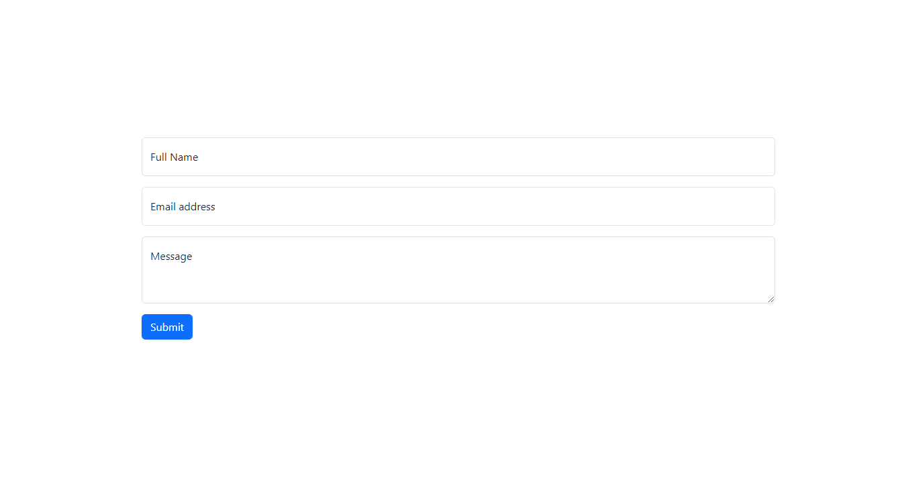
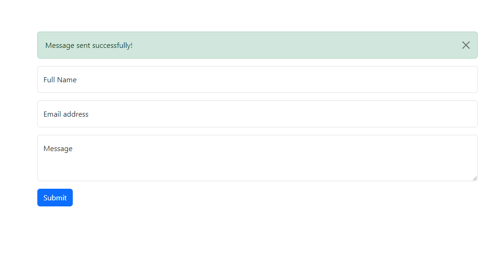
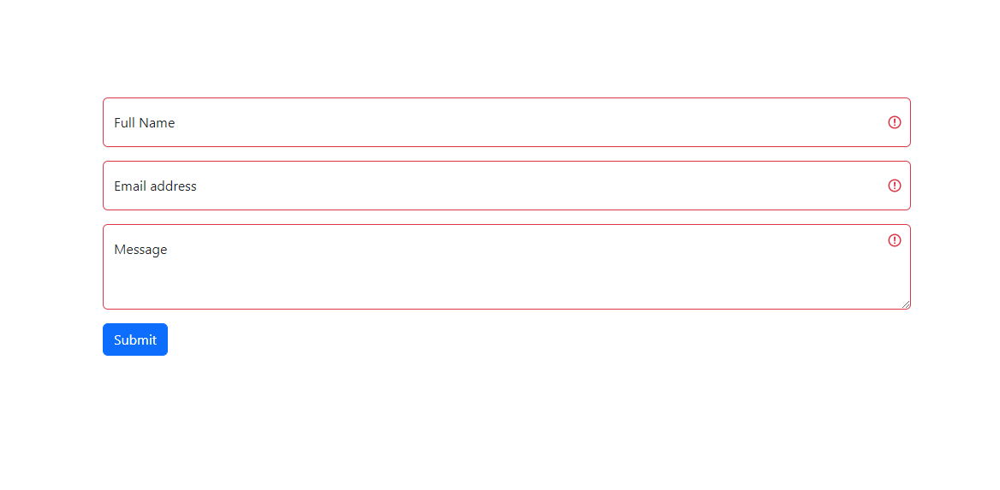
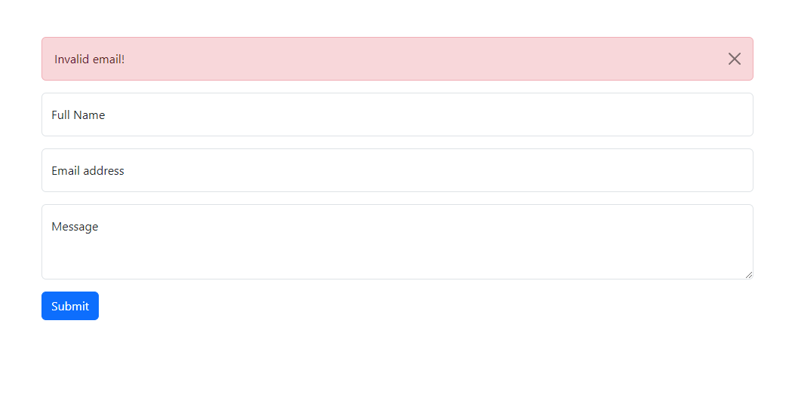

# Kamp Kode Backend Internship Assignment

## Description

This is a simple Express application that captures user input from an HTML form (Bootstrap) and stores it in Firebase Firestore. It includes form validation, user feedback upon submission, error handling, and logging.

## Packages Used

- `body-parser`: ^1.20.2
- `dotenv`: ^16.4.5
- `ejs`: ^3.1.10
- `express`: ^4.19.2
- `express-validator`: ^7.1.0
- `firebase-admin`: ^12.2.0
- `nodemon`: ^3.1.4

## Setup

1. Clone the repository:

   ```bash
   git clone https://github.com/BahaaAY/kamp-kode-assignment.git
   cd kamp-kode-assignment
   ```

2. Install the dependencies:

   ```bash
   npm install
   ```

3. Create a `.env` file in the root directory and add your Firebase credentials:

   ```env
    FIREBASE_CREDENTIALS=your_firebase_credentials
   ```

## Running the Application

1. To start the application in production mode, run:

   ```bash
   npm start
   ```

2. To start the application in development mode with \`nodemon\`, run:

   ```bash
   npm run dev
   ```

## Screenshots

<p float="left">
  
  

</p>
<p float="left">
  
  
</p>
